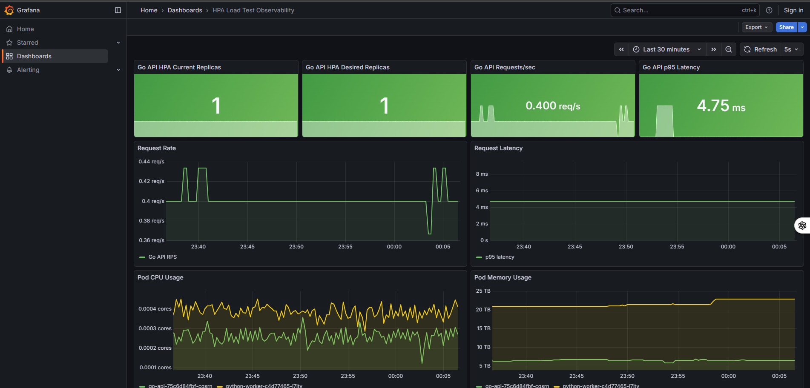
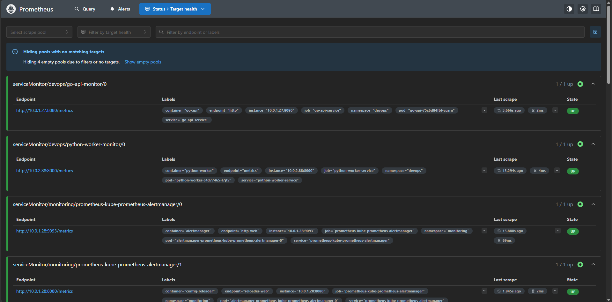
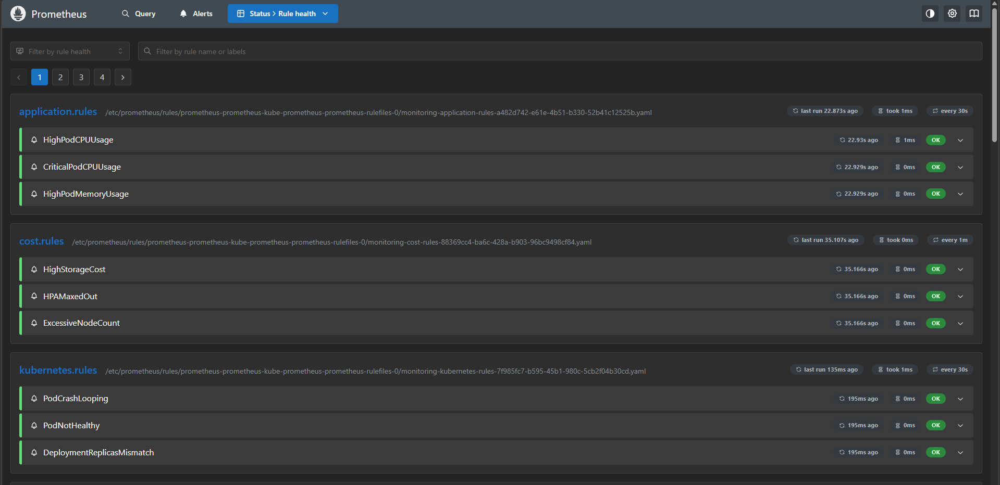
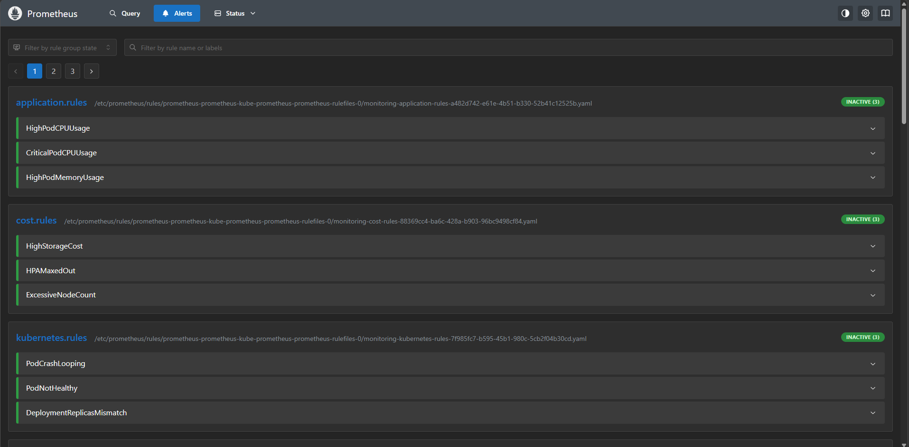
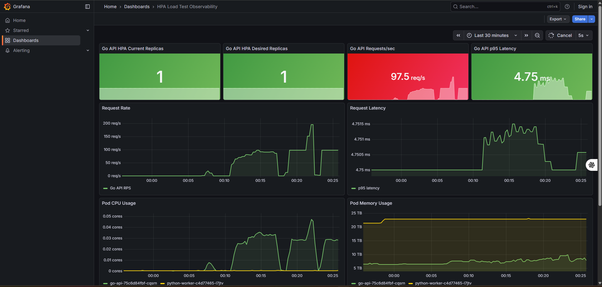
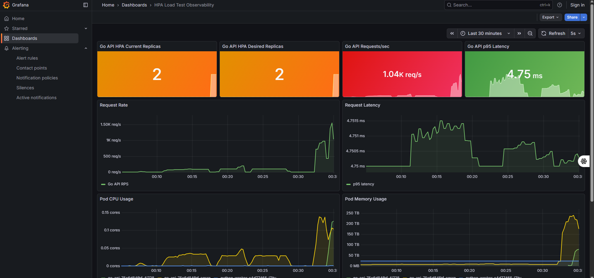

# DevOps Platform

A small end-to-end DevOps project built around Terraform, Ansible, Jenkins, EKS, Prometheus, and Grafana.

## Overview

The repository provisions AWS infrastructure, configures a Jenkins host, and deploys two containerized services to EKS:

- a Go API
- a Python worker

Infrastructure bootstrap is done locally with Terraform and Ansible. Application deployment is handled by Jenkins after a one-time manual pipeline setup.

## Stack

- AWS: EC2, EKS, IAM, VPC, Load Balancer
- Terraform: infrastructure provisioning
- Ansible: Jenkins host configuration
- Jenkins: image build and deployment pipeline
- Docker: container builds
- Kubernetes: application runtime and HPA
- Prometheus and Grafana: metrics and dashboards
- Alertmanager: alert routing
- Vegeta and shell-based checks: load testing

## Repository Layout

```text
devops-platform/
├── ansible/            Jenkins host provisioning
├── app-go/             Go API
├── app-python/         Python worker
├── docker/             Dockerfiles
├── docs/               Architecture, flow, troubleshooting
├── k8s/aws/            Kubernetes manifests
├── monitoring/         Helm values, rules, dashboards
├── scripts/            Deployment and test scripts
├── terraform/aws/      AWS infrastructure
├── Jenkinsfile         Jenkins pipeline
└── README.md
```

## Deployment Model

### 1. Bootstrap infrastructure

```bash
bash scripts/deploy-complete.sh
```

This script:

- applies Terraform
- provisions Jenkins and EKS
- updates Ansible inventory
- configures Jenkins on the EC2 host

It stops after infrastructure and Jenkins host setup.

### 2. Complete Jenkins setup once

Open Jenkins, finish the initial setup, create the pipeline job, and point it at this repository using `Jenkinsfile`.

### 3. Deploy applications through Jenkins

Run the pipeline once to:

- build Docker images
- push images to Docker Hub
- apply Kubernetes manifests
- roll out the current image tags to EKS

After that initial setup, normal pushes can trigger Jenkins automatically.

## Monitoring

Deploy the monitoring stack with:

```bash
bash scripts/deploy-monitoring.sh
```

The stack includes:

- Prometheus
- Grafana
- Alertmanager
- ServiceMonitor resources for the application metrics endpoints

## Load Testing

Run the built-in load test with:

```bash
bash scripts/load-test.sh
```

For fixed-rate testing, a containerized Vegeta run is also supported.

### Featured Heavy Run (Interview Proof)

The latest heavy run artifact is included in the repository:

- profile: 1000 requests/second for 300 seconds
- total requests: 300,000
- throughput: 979.41 requests/second
- successful responses: 293,991 (`98.00%` success ratio)
- failed/timeouts: 6,009
- mean latency: 1.637s
- p95 latency: 6.543s
- max latency: 30.091s
- HPA scale events observed: `1 -> 2 -> 3 -> 2 -> 1`

Raw report with Vegeta output and HPA events:

- `load-test-results/load-test-results-20260310-heavy-vegeta-1000rps-300s.txt`

Additional baseline smoke test report:

- `load-test-results/load-test-results-20260310-183653.txt`

### Observability Evidence

Interview-focused screenshot map:

1. `docs/screenshots/ideal-cluster-state.png`: ideal cluster state in Grafana
2. `docs/screenshots/prometheus-target-health.png`: Prometheus target health status
3. `docs/screenshots/prometheus-rule-health.png`: Prometheus rule health status
4. `docs/screenshots/prometheus-alerts.png`: active alerts in Prometheus
5. `docs/screenshots/baseline-load-test-100rps.png`: baseline load test at 100 requests/second
6. `docs/screenshots/hpa-proof-scale-up-1.png`: HPA autoscaling proof snapshot 1
7. `docs/screenshots/hpa-proof-scale-up-2.png`: HPA autoscaling proof snapshot 2









## Documentation

- `docs/ARCHITECTURE.md`
- `docs/PROJECT_FLOW.md`
- `docs/TROUBLESHOOTING.md`
- `monitoring/README.md`
